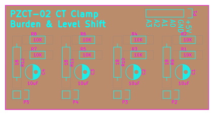
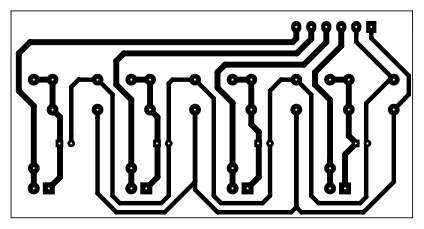

# PZCT-02-BurdenShift
Resistive burden &amp; level shift to convert PZCT-02 Split-core Current Transformer output to ADC input voltages.

 

In searching for split-core current transformers, I ran across the PZCT-02. A rather inexpensive split-core 100 Amp transformer.
[Amazon](https://www.amazon.com/s?k=PZCT-02+current+transformer)
[AliExpress](https://www.aliexpress.com/wholesale?SearchText=PZCT-02)

This circuit provides burden resistance, voltage division & test point shifting to feed measurements into an Analog to Digital Converter (ADC).

I've used this with the 10bit analog input pins on Arduino's, as well as an ADS1115 16-bit ADC hooked to a raspberry pi I2C bus.

Both approaches work well. But I prefer the 16bit resolution on the I2C bus of the Pi, which can be polled rediculously fast using Collectd and the 'sensors' plugin.
